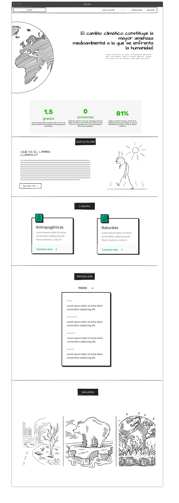

# CAMBIO CLIMATICO

## **Situación Problema**

El cambio climático es uno de los grandes desafíos de nuestro tiempo, que afecta a todos los aspectos de la vida humana y del planeta. La crisis climática tiene consecuencias negativas para la salud, la seguridad, la alimentación, el agua, la biodiversidad y el desarrollo. Además, el cambio climático también impacta en la educación, ya que dificulta el acceso, la permanencia y el aprendizaje de los estudiantes, especialmente de los más vulnerables.

Ante esta situación, es necesario promover una educación que contribuya a la comprensión y la acción frente al cambio climático, que forme ciudadanos conscientes, responsables y comprometidos con el medio ambiente. Una educación que ofrezca recursos visuales, información actualizada para educar a usuarios de diversas edades sobre el cambio climático y sus soluciones.

Por eso, se propone crear una plataforma web educativa que brinde estos recursos, que sea accesible, atractiva  y que permita a los usuarios aprender sobre el cambio climático y cómo pueden contribuir a mitigarlo y adaptarse a él. Esta plataforma web pretende ser un espacio de sensibilización, información y participación para fomentar una cultura ambiental en la sociedad.

## **Objetivo**

Diseñar y desarrollar una plataforma web educativa, utilizando recursos digitales de diseño como Figma e Illustrator y las tecnologías de desarrollo web mas comunes como lo son HTML, CSS y JAVASCRIPT.  Esta pagina Web brindara recursos visuales e información actualizada para educar a usuarios de diversas edades sobre el cambio climático, sus causas, impactos y soluciones, al igual que noticias sobre temas que se viven en la actualidad fomentando así una comprensión profunda y la adopción de acciones sostenibles.

## Estado del Arte

### Los temas principales y que pensamos resolver en nuestra web son:

- ¿Qué es el cambio climático?
- El cambio climático natural
- El cambio climático con influencia humana
- Efectos del cambio climático
- Mitigación del cambio
- Desafíos del cambio climático
- Impacto social del cambio climático
    - Tecnológico
    - Sociopolítico
    - Socioeconómico
    
    ---
### (Enunciado principal)

El cambio climático constituye la mayor amenaza medioambiental a la que se enfrenta la humanidad.

1,5 grados: Cerca de 200 países acordaron fijar en 1,5 ºC el umbral máximo de aumento de la temperatura del planeta.
0 emisiones: Debemos reducir a cero las emisiones netas de gases de efecto invernadero para 2040 en toda la UE si no queremos vivir los peores efectos del cambio climático.

¿Alguna vez te has preguntado quées realmente el cambio climático? o ¿Cómo nos afecta?. Existen mitos al respecto pero no todo el mundo conoce la magnitud de su impacto sobre el planeta.

El cambio climático se refiere a los cambios a largo plazo de las temperaturas y lospatrones climáticos. Estos cambios pueden ser naturales, debido a variaciones en la actividad solar o erupciones volcánicas grandes. Pero desde el siglo XIX, las actividades humanas han sido el principal motor del cambio climático, debido principalmente a la quema de combustibles fósiles como el carbón, el petróleo y el gas; esto genera emisiones de gases de efecto invernadero principalmente el dióxido de carbono y el metano, lo cuales actúan como una manta que envuelve la Tierra, atrapando el calor del sol y elevando las temperaturas.

Los impactos del cambio climático ya son perceptibles y quedan puestos en evidencia por datos de la Organización Meteorológica Mundial (OMM) como

-La temperatura media mundial ha aumentado ya 1,11% ± 0,13 °C desde la época preindustrial

- Los siete años transcurridos desde 2015 sonlos más cálidos de los que se tienen datos. La década de 2011 a 2020 fue la más cálida jamás registrada.
- Las emisiones de gases de efecto invernadero a nivel global siguen aumentando cada año, alcanzando el máximo de 59 GT CO2 eq. en 2019 (IPCC, 2022).
- En octubre de 2022, la concentración media mensual de CO2, medida por la Oficina Nacional de Administración Oceánica y Atmosférica (NOAA) de Estados Unidos en su observatorio de Mauna Loa, en Hawai, volvió a alcanzar un máximo histórico acumulado de 420,99 partes por millón (ppm), una cantidad de CO2 que no se registraba desde hace tres millones de años.
- El nivel medio del mar a escala mundial alcanzó un nuevo máximo en 2021, tras aumentar una media de 4,5 mm anuales durante el período 2013-2021. Esta cifra es más del doble que la registrada entre 1993 y 2002.

Además, otros sus impactos también se han manifestado con mayor intensidad: Los fenómenos meteorológicos extremos, como danas, tormentas y huracanes.

Olas de calor más intensas, duraderas y frecuentes que nunca antes. Mega-incendios.

Las sequías.

Esos impactos provocan a su vez daños económicos y sociales, que serán cadavez más graves, como daños en las cosechas y en la producción alimentaria o riesgos en la salud.

El cambio climático es un problema global que alcanza una perspectiva ambiental, política, económica y social en la que las peores previsiones también implican enormes pérdidas económicas. Y es que cuanto más tardemos en actuar, mucho más elevadas serán las inversiones para la adaptación al aumento de la temperatura y puede llegarse aun límite en que la adaptación ya no sea posible.

## Causas Antropogénicas

1. **Deforestación**: La tala de bosques y la conversión de áreas forestales en tierras agrícolas o urbanas disminuyen la capacidad de la Tierra para absorber el CO2 de la atmósfera. Los bosques actúan como sumideros naturales de carbono, y su eliminación contribuye a un aumento en los niveles de CO2en la atmósfera.
2. **Agricultura y ganadería intensivas**: La producción de alimentos a gran escala puede generar emisiones significativas de metano y óxido nitroso, dos gases de efecto invernadero El ganado, en particular, produce metano durante la digestión y la fermentación en sus sistemas digestivos.
3. **Uso de energía**: La demanda de energía en todas sus formas, desde la electricidad hasta el calor industrial, con frecuencia proviene de fuentes que emiten gases de efecto La transición hacia fuentes de energía más limpias y renovables es crucial para reducir las emisiones.
4. **Cambios en el uso del suelo**: Además de la deforestación, otros cambios en el uso del suelo, como la urbanización y la degradación del suelo, pueden liberar carbono almacenado en la tierraal
5. **Actividades industriales**: La producción de cemento, acero, productos químicos y otros bienes a menudo implica procesos que emiten gases de efecto invernadero. También pueden liberarse gases durante la extracción y el procesamiento de recursos
6. **Transporte**: Los vehículos que queman combustibles fósiles, como automóviles, camiones y aviones, emiten CO2 y otros contaminantes a la atmósfera.
7. **Crecimiento de la población y desarrollo económico**: A medida que la población mundial crece y más regiones buscan desarrollo económico, aumenta la demanda de recursos y energía, lo que puede aumentar las emisiones de gases de efecto

Estas causas interactúan de manera compleja y contribuyen al calentamiento global y otros impactos climáticos. Para abordar el cambio climático, es esencial tomar medidas para reducir las emisiones de gases de efecto invernadero y adoptar prácticas más sostenibles en todos los sectores de la sociedad.

## Causas Naturales

1. **Variabilidad solar**: Las variaciones en la actividad del sol pueden influir en el clima de la Aunque estas variaciones solares pueden tener efectos temporales en el clima, los estudios científicos han demostrado que las fluctuaciones solares no son la causa dominante del calentamiento global observado en las últimas décadas.
2. **Ciclos orbitales**: Cambios en la órbita de la Tierra alrededor del sol pueden alterar la cantidad de energía solar que llega a la Tierra y desempeñar un papel en los cambios climáticos a largo plazo. Estos ciclos orbitales son conocidos como los parámetros de Milankovitch y pueden influir en las edades de hielo y períodos
3. **Erupciones volcánicas**: Las erupciones volcánicas pueden liberar grandes cantidades de gases y partículas a la atmósfera, lo que puede tener un impacto temporal en el clima. Las partículas liberadas pueden bloquear la radiación solar y enfriar la atmósfera durante un tiempo
4. **Circulación oceánica**: Los patrones de circulación oceánica, como El Niño y La Niña, pueden influir en la distribución de la temperatura y la humedad en la atmósfera y tener efectos temporales en el Estos patrones tienen un impacto regional significativo, pero su contribución al cambio climático global es más limitada.

Aunque estos factores naturales pueden tener influencias en el clima a lo largo de períodos de tiempo más largos, la evidencia científica respalda la idea de que las actividades humanas, son la principal causa del cambio climático observado en los tiempos modernos.

# CONSECUENCIAS

### Cómo afecta el cambio climático a los océanos del planeta

- *Impacto como Sumidero de Carbono:**
- El océano es crucial como sumidero de carbono, absorbiendo alrededor del 90

% del calor generado por las emisiones de gases de efecto invernadero.

- Sin esta función, el cambio climáticohabría hecho la Tierra
- *Aceleración del Aumento del Nivel del Mar:**
- El deshielo polar ha acelerado la subida del nivel del mar, con un aumento promedio de 5 mm al año desde 2013 hasta 2021.
- Esto intensifica eventos extremos terrestres como mareas mortales, inundaciones y erosiones
- *Olas de Calor Marinas:**
- La frecuencia y severidad de las olas de calor marinas se ha duplicado debido a la influencia
- Entre 2006 y 2015, estas olas afectaron a los corales, causando decoloración y degradación de los
- En 2021, el 60 % de la superficie oceánica experimentó olas de calor, lo que amenaza la supervivencia de los
- *Pérdida de Biodiversidad Marina:**
- El aumento de las temperaturas pone en riesgo la biodiversidad de los ecosistemas costeros y
- Los arrecifes de coral y manglares, vitales para la vida marina, se dañan.
- Algunas especies migranhacia aguas más frías o altas, lo que podría afectar su
- Más del 50 % de las especies marinas podrían estar en peligro de extinción para 2100 debido al calentamiento global, y el 60 % de los ecosistemas marinos ya se degradan o se explotan de manera
- *Impacto en la Vida Marina y Alimentación Humana:**
- El aumento de las temperaturas oceánicas provoca el blanqueo de corales, afectando a los ecosistemas de arrecifes yla
- Las aguas más cálidas impulsan la migración de especies marinas, afectando su reproducción y alimentación.
- Cambios en la temperatura del agua afectan el desarrollo de peces y cefalópodos, esenciales para la alimentación de 3 mil millones de personas que dependendel
- *Derritiendo los Polos y Efectos Subacuáticos:**
- El hielo marino ártico disminuye, afectando la producción de algas, base de la cadena alimentaria en el Ártico.
- La pérdida de hielo marino amenaza el hábitat de especies como osos polares y
- El krill antártico, fuente de alimento clave, se ve afectado por la disminución del hielo
- *Aumento del Nivel del Mar:**
- El deshielo polar y la expansióndel agua cálida estánelevando el nivel del mar, amenazando a zonas costeras y comunidades
- Pequeñas naciones insulares del Pacífico enfrentan el riesgo de
- Hábitats costeros críticos y playas de desove de tortugas se pierden debido al aumento del nivel del
- *Alteraciónde las Corrientes Oceánicas:**
- El cambio climáticoafecta las temperaturas y patrones de viento, perturbando las corrientes oceánicas.
- Cambios en las corrientes afectan las migraciones y la reproducción de especies
- Alteraciones en las corrientes pueden tener consecuencias drásticas en el clima global y la distribución de
- *Acidificación del Agua de Mar:**
- La quema de combustibles fósiles provoca la acidificación del agua de
- Esto afecta a organismos marinos que construyen conchas de carbonato de calcio, incluyendo corales, vieiras y
- La acidificación tambiéninterrumpe la cadena alimentaria al limitar la capacidad de ciertos peces para detectar

El océano está sufriendo graves consecuencias debido al calentamiento global, incluyendo un aumento del nivel del mar acelerado, olas de calor marinas devastadoras y la pérdida de biodiversidad. Estos impactos no solo afectan a la vida marina, sino que también tienen graves implicaciones para la humanidad y el equilibrio de los ecosistemas en todo el mundo.

**La** **desaparición** **de** **animales** **y** **su** **influencia** **en** **el** **clima:**

El calentamiento global afecta a los ecosistemas y la fauna, pero también es importante notar que los propios animales puedeninfluir en el clima. La Tierra ha perdido el 69% de las poblaciones de vertebrados en 50 años. La extinción de especies debido al cambio climático puede cambiar las condiciones climáticas.

Los animales, especialmente los que ocupan lugares altos en la cadena alimentaria, desempeñan un papel vital en el equilibrio ecológico y en la regulación del ciclo del carbono. Por ejemplo, grandes herbívoros como elefantes y

rinocerontes mantienen la salud de los ecosistemas al controlar la vegetación y ayudar en la dispersión de semillas.

Las ballenas también son clave en la captura y almacenamiento de carbono en los océanos. Sus cuerpos retienen carbono en las profundidades marinas, y sus heces, ricas en hierro, estimulan el crecimiento del fitoplancton, que captura el 40% del CO2 del planeta. La escasez de ballenas afecta negativamente la fertilidad marina.

La desaparición de abejas, fundamentales en la polinizaciónde plantas, conduciría al declive de vegetales y desequilibraría los ecosistemas alimentarios. Con un millón de especies en peligro de extinción, debemos reconocer su impacto en la regulación del clima.

### Mitigación

La mitigación del cambio climático se refiere a las acciones y estrategias destinadas a reducir o evitar la emisión de gases de efecto invernadero y, por lo tanto, a disminuir el calentamiento global y sus impactos asociados. Aquí hay algunas de las principales áreas y enfoques de mitigación:

1. **Transición a fuentes de energía limpias y renovables**: Reducir la dependencia de los combustibles fósiles, como el carbón, el petróleo y el gas natural, y cambiar hacia fuentes de energía renovable, como la solar, la eólica, la hidroeléctrica y la geotérmica. Esto disminuirá significativamente las emisiones de dióxido de carbono (CO2) provenientes de la generación de energía.
2. **Eficiencia energética**: Mejorar la eficiencia en el uso de la energía en edificios, transporte, industria y otros Reducir el consumo de energía disminuye la necesidad de generar energía y, por lo tanto, reduce las emisiones.
3. **Conservación forestal y reforestación**: Proteger los bosques existentes y llevar a cabo actividades de reforestación para aumentar la cantidad de árboles y la absorción de CO2 de la atmósfera.
4. **Agricultura sostenible**: Adoptar prácticas agrícolas más sostenibles que reduzcan las emisiones de gases de efecto invernadero, como el uso eficiente de fertilizantes, la gestión de residuos agrícolas y la mejora de las prácticas de
5. **Transporte sostenible**: Fomentar el uso de medios de transporte más limpios y eficientes, como vehículos eléctricos, transporte público, bicicletas y También se pueden implementar políticas para reducir las emisiones en la industria del transporte.
6. **Tecnologías de captura y almacenamiento de carbono (CAC)**: Desarrollar y aplicar tecnologías que capturen el CO2 de las fuentes de emisión, como plantas de energía, y lo almacenen de manera segura en formaciones geológicas subterráneas.
7. **Reducción de emisiones industriales**: Mejorar la eficiencia en procesos industriales, reducir las fugas de gases de efecto invernadero y fomentar la adopción de tecnologías limpias en la
8. **Políticas y regulaciones climáticas**: Establecer políticas, regulaciones y acuerdos internacionales que promuevan la mitigación del cambio climático. Ejemplos notables incluyen el Acuerdo de París, en el que los países se comprometen a reducir sus
9. **Educación y concienciación pública**: Informar y educar a la sociedad sobre el cambio climático y sus impactos, fomentando cambios en el comportamiento y la toma de decisiones en dirección a la

La mitigación del cambio climático es esencial para limitar los riesgos y consecuencias del calentamiento global. Requiere una acción coordinada a nivel global, nacional y local, involucrando a gobiernos, empresas, comunidades y ciudadanos individuales.

### Consejos para luchar contra el cambio climático

Lograr un planeta más sostenible y respetuoso con la naturaleza es posible con el esfuerzo de todos. Por esta razón, recopilamos una serie de recomendaciones avaladas desde el Programa de Naciones Unidas para el Medio Ambiente (PNUMA) que contribuyen a construir un futuro más verde:

1. Reduce el consumo, siguiendo el ODS 12 de la Agenda Transformar nuestros hábitos de consumo en otros más sostenibles es esencial para luchar contra el cambio climático y la contaminación.
2. Desconecta el cargador después de cargar tu teléfono para ahorrar energía.
3. Elimina el uso de botellas de plástico de tu En un año, podrás ahorrar hasta 167 botellas de plástico.
4. Evita objetos de plástico, uno de los materiales más
5. Utiliza bolsas de tela para tus compras, ya que son resistentes y sustituyen a más de 100 bolsas de plástico.
6. Haz un uso responsable de la calefacción y mantén el termostato lo más bajo
7. Apuesta por una alimentación sostenible, ya que los sistemas alimentarios tienen un impacto en el cambio climático a través de las emisiones de gases de efecto Tus elecciones alimentarias son cruciales para enfrentar la emergencia climática global.

Estos consejos contribuirán a un futuro más verde y sostenible para todos.

## Diseño base

### Webgrafía

[https://www.fundacionaquae.org/wiki/causas-y-consecuencias-cambio-climatico/](https://www.fundacionaquae.org/wiki/causas-y-consecuencias-cambio-climatico/)

[https://www.gob.mx/inecc/acciones-y-programas/que-es-el-cambio-climatico](https://www.gob.mx/inecc/acciones-y-programas/que-es-el-cambio-climatico)

[https://www.bbc.com/mundo/noticias-58912801](https://www.bbc.com/mundo/noticias-58912801)

[https://www.un.org/es/climatechange/what-is-climate-change](https://www.un.org/es/climatechange/what-is-climate-change)

[https://www.fundacionaquae.org/wiki/causas-y-consecuencias-cambio-climatico/](https://www.fundacionaquae.org/wiki/causas-y-consecuencias-cambio-climatico/)
[https://www.gob.mx/inecc/acciones-y-programas/que-es-el-cambio-climatico](https://www.gob.mx/inecc/acciones-y-programas/que-es-el-cambio-climatico)

[https://www.un.org/es/climatechange/science/key-findings](https://www.un.org/es/climatechange/science/key-findings)

[https://www.iberdrola.com/sostenibilidad/mitigacion-y-adaptacion-al-cambio-climatico](https://www.iberdrola.com/sostenibilidad/mitigacion-y-adaptacion-al-cambio-climatico)

[https://es.greenpeace.org/es/trabajamos-en/cambio-climatico/](https://es.greenpeace.org/es/trabajamos-en/cambio-climatico/)

[https://climate.nasa.gov/en-espanol/datos/efectos/](https://climate.nasa.gov/en-espanol/datos/efectos/)

[https://www.unicef.org/es/medio-ambiente-cambio-climatico](https://www.unicef.org/es/medio-ambiente-cambio-climatico)

### Bancos de imágenes y visuales

[https://www.midjourney.com/home/?callbackUrl=%2Fapp%2F](https://www.midjourney.com/home/?callbackUrl=%2Fapp%2F)

[https://stock.adobe.com/es/](https://stock.adobe.com/es/premium)

[https://pixabay.com/es/](https://pixabay.com/es/)
[https://www.nationalgeographic.es/medio-ambiente/2021/10/imagenes-para-capturar-la-devastacion-del-cambio-climatico-y-la-esperanza-para-el-futur](https://www.nationalgeographic.es/medio-ambiente/2021/10/imagenes-para-capturar-la-devastacion-del-cambio-climatico-y-la-esperanza-para-el-futur)
